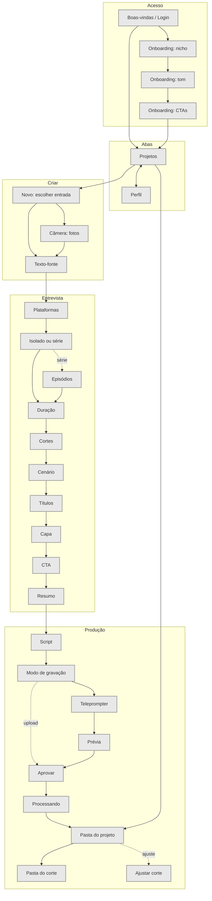

# Mapa de telas — flowchart

```mermaid
graph TD
    subgraph Acesso
        BV[Boas-vindas / Login]
        ON1[Onboarding: nicho] --> ON2[Onboarding: tom] --> ON3[Onboarding: CTAs]
    end
    subgraph Abas
        PJ[Projetos]
        PF[Perfil]
    end
    subgraph Criacao[Criar]
        NE[Novo: escolher entrada] --> CAM[Câmera: fotos]
        NE --> TF[Texto-fonte]
        CAM --> TF
    end
    subgraph Entrevista
        E1[Plataformas] --> E2[Isolado ou série] --> E3[Duração] --> E4[Cortes] --> E5[Cenário] --> E6[Títulos] --> E7[Capa] --> E8[CTA] --> ER[Resumo]
        E2 -.série.-> ES[Episódios]
        ES --> E3
    end
    subgraph Producao[Produção]
        SC[Script] --> GM[Modo de gravação] --> TP[Teleprompter] --> PV[Prévia]
        GM -.upload.-> AP
        PV --> AP[Aprovar] --> PR[Processando] --> PP[Pasta do projeto] --> PC[Pasta do corte]
        PP -.ajuste.-> AC[Ajustar corte]
    end
    BV --> ON1
    BV --> PJ
    ON3 --> PJ
    PJ --> NE
    PJ --> PP
    PJ <--> PF
    TF --> E1
    ER --> SC
    class BV,ON1,ON2,ON3,PJ,PF,NE,CAM,TF,E1,E2,E3,E4,E5,E6,E7,E8,ER,ES,SC,GM,TP,PV,AP,PR,PP,PC,AC screen
    classDef screen fill:#e8e8e8,stroke:#999,stroke-width:2px
    classDef decision fill:#fff3cd,stroke:#ffc107,stroke-width:2px
    classDef action fill:#d4edda,stroke:#28a745,stroke-width:1px
    classDef error fill:#f8d7da,stroke:#dc3545,stroke-width:1px
```
