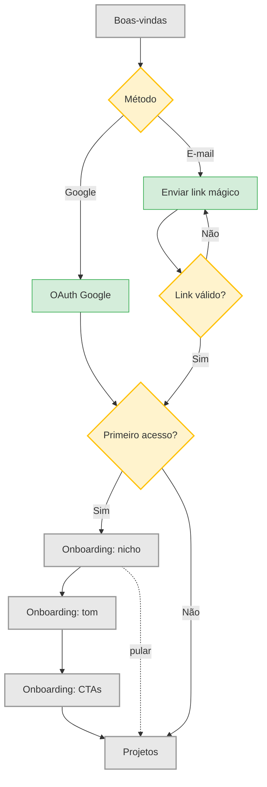

# UC-001 Entrar e configurar perfil — fluxo

```mermaid
graph TD
    A[Boas-vindas] --> B{Método}
    B -->|Google| C[OAuth Google]
    B -->|E-mail| D[Enviar link mágico] --> E{Link válido?}
    E -->|Não| D
    E -->|Sim| F{Primeiro acesso?}
    C --> F
    F -->|Sim| G[Onboarding: nicho] --> H[Onboarding: tom] --> I[Onboarding: CTAs] --> J[Projetos]
    F -->|Não| J
    G -.pular.-> J
    class A,G,H,I,J screen
    class B,E,F decision
    class C,D action
    classDef screen fill:#e8e8e8,stroke:#999,stroke-width:2px
    classDef decision fill:#fff3cd,stroke:#ffc107,stroke-width:2px
    classDef action fill:#d4edda,stroke:#28a745,stroke-width:1px
    classDef error fill:#f8d7da,stroke:#dc3545,stroke-width:1px
```
