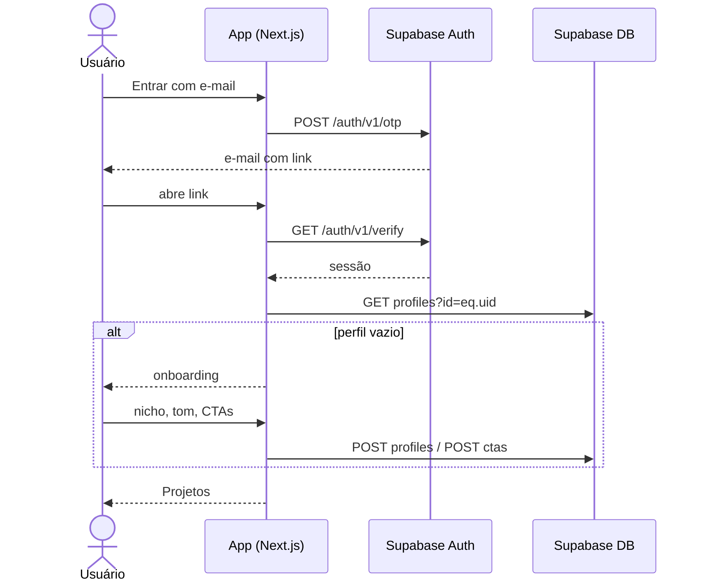

# UC-001 Entrar e configurar perfil — sequência

```mermaid
sequenceDiagram
    actor U as Usuário
    participant F as App (Next.js)
    participant S as Supabase Auth
    participant DB as Supabase DB
    U->>F: Entrar com e-mail
    F->>S: POST /auth/v1/otp
    S-->>U: e-mail com link
    U->>F: abre link
    F->>S: GET /auth/v1/verify
    S-->>F: sessão
    F->>DB: GET profiles?id=eq.uid
    alt perfil vazio
        F-->>U: onboarding
        U->>F: nicho, tom, CTAs
        F->>DB: POST profiles / POST ctas
    end
    F-->>U: Projetos
```
