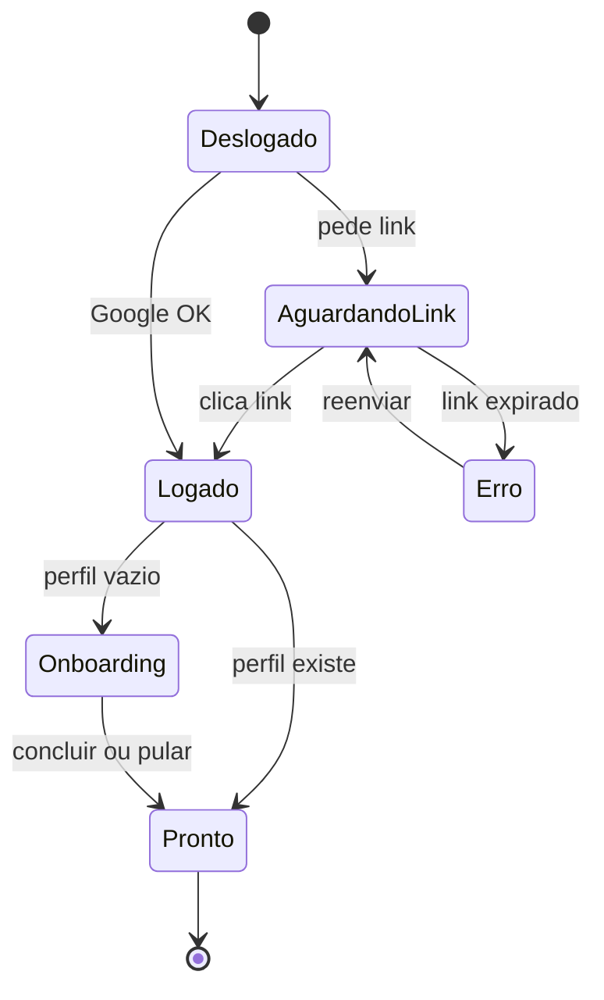

# UC-001 Entrar e configurar perfil — estados

```mermaid
stateDiagram-v2
    [*] --> Deslogado
    Deslogado --> AguardandoLink: pede link
    AguardandoLink --> Logado: clica link
    AguardandoLink --> Erro: link expirado
    Erro --> AguardandoLink: reenviar
    Deslogado --> Logado: Google OK
    Logado --> Onboarding: perfil vazio
    Logado --> Pronto: perfil existe
    Onboarding --> Pronto: concluir ou pular
    Pronto --> [*]
```
