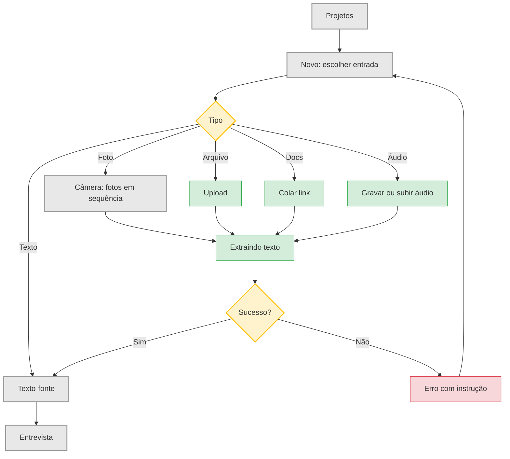

# UC-002 Criar projeto a partir de material — fluxo

```mermaid
graph TD
    A[Projetos] --> B[Novo: escolher entrada]
    B --> C{Tipo}
    C -->|Foto| D[Câmera: fotos em sequência]
    C -->|Texto| T[Texto-fonte]
    C -->|Arquivo| E[Upload]
    C -->|Docs| G[Colar link]
    C -->|Áudio| H[Gravar ou subir áudio]
    D --> X[Extraindo texto]
    E --> X
    G --> X
    H --> X
    X --> Y{Sucesso?}
    Y -->|Sim| T
    Y -->|Não| Z[Erro com instrução] --> B
    T --> I[Entrevista]
    class A,B,D,T,I screen
    class C,Y decision
    class E,G,H,X action
    class Z error
    classDef screen fill:#e8e8e8,stroke:#999,stroke-width:2px
    classDef decision fill:#fff3cd,stroke:#ffc107,stroke-width:2px
    classDef action fill:#d4edda,stroke:#28a745,stroke-width:1px
    classDef error fill:#f8d7da,stroke:#dc3545,stroke-width:1px
```
