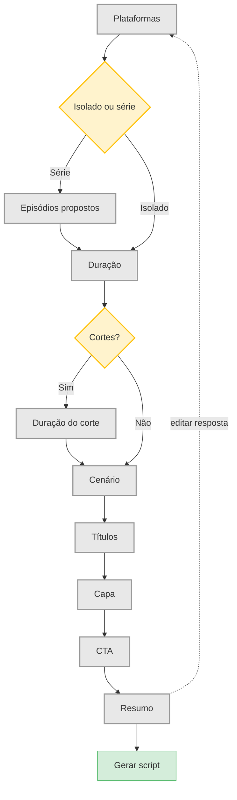

# UC-003 Entrevista do vídeo — fluxo

```mermaid
graph TD
    A[Plataformas] --> B{Isolado ou série}
    B -->|Série| S[Episódios propostos] --> C
    B -->|Isolado| C[Duração]
    C --> D{Cortes?}
    D -->|Sim| D2[Duração do corte] --> E
    D -->|Não| E[Cenário]
    E --> F[Títulos] --> G[Capa] --> H[CTA] --> R[Resumo]
    R -.editar resposta.-> A
    R --> Z[Gerar script]
    class A,S,C,D2,E,F,G,H,R screen
    class B,D decision
    class Z action
    classDef screen fill:#e8e8e8,stroke:#999,stroke-width:2px
    classDef decision fill:#fff3cd,stroke:#ffc107,stroke-width:2px
    classDef action fill:#d4edda,stroke:#28a745,stroke-width:1px
    classDef error fill:#f8d7da,stroke:#dc3545,stroke-width:1px
```
