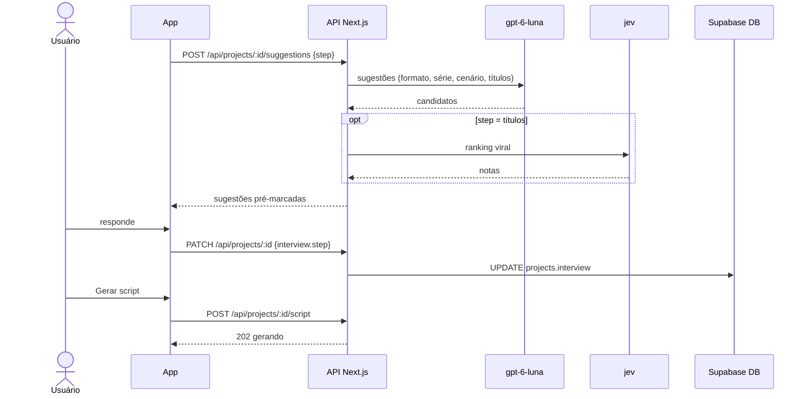

# UC-003 Entrevista do vídeo — sequência

```mermaid
sequenceDiagram
    actor U as Usuário
    participant F as App
    participant API as API Next.js
    participant L as gpt-6-luna
    participant J as jev
    participant DB as Supabase DB
    F->>API: POST /api/projects/:id/suggestions {step}
    API->>L: sugestões (formato, série, cenário, títulos)
    L-->>API: candidatos
    opt step = títulos
        API->>J: ranking viral
        J-->>API: notas
    end
    API-->>F: sugestões pré-marcadas
    U->>F: responde
    F->>API: PATCH /api/projects/:id {interview.step}
    API->>DB: UPDATE projects.interview
    U->>F: Gerar script
    F->>API: POST /api/projects/:id/script
    API-->>F: 202 gerando
```
