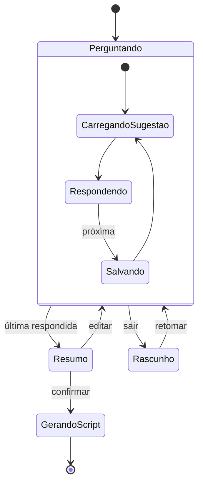

# UC-003 Entrevista do vídeo — estados

```mermaid
stateDiagram-v2
    [*] --> Perguntando
    state Perguntando {
        [*] --> CarregandoSugestao
        CarregandoSugestao --> Respondendo
        Respondendo --> Salvando: próxima
        Salvando --> CarregandoSugestao
    }
    Perguntando --> Resumo: última respondida
    Resumo --> Perguntando: editar
    Resumo --> GerandoScript: confirmar
    Perguntando --> Rascunho: sair
    Rascunho --> Perguntando: retomar
    GerandoScript --> [*]
```
