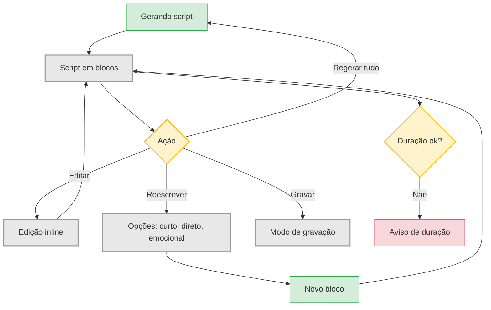

# UC-004 Revisar e editar script — fluxo

```mermaid
graph TD
    A[Gerando script] --> B[Script em blocos]
    B --> C{Ação}
    C -->|Editar| D[Edição inline] --> B
    C -->|Reescrever| E[Opções: curto, direto, emocional] --> F[Novo bloco] --> B
    C -->|Regerar tudo| A
    C -->|Gravar| G[Modo de gravação]
    B --> H{Duração ok?}
    H -->|Não| W[Aviso de duração]
    class B,D,E,G screen
    class C,H decision
    class A,F action
    class W error
    classDef screen fill:#e8e8e8,stroke:#999,stroke-width:2px
    classDef decision fill:#fff3cd,stroke:#ffc107,stroke-width:2px
    classDef action fill:#d4edda,stroke:#28a745,stroke-width:1px
    classDef error fill:#f8d7da,stroke:#dc3545,stroke-width:1px
```
