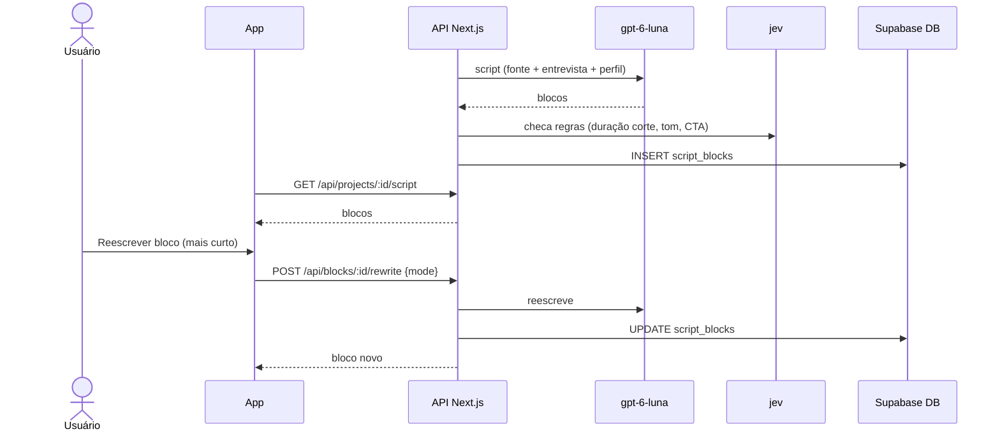

# UC-004 Revisar e editar script — sequência

```mermaid
sequenceDiagram
    actor U as Usuário
    participant F as App
    participant API as API Next.js
    participant L as gpt-6-luna
    participant J as jev
    participant DB as Supabase DB
    API->>L: script (fonte + entrevista + perfil)
    L-->>API: blocos
    API->>J: checa regras (duração corte, tom, CTA)
    API->>DB: INSERT script_blocks
    F->>API: GET /api/projects/:id/script
    API-->>F: blocos
    U->>F: Reescrever bloco (mais curto)
    F->>API: POST /api/blocks/:id/rewrite {mode}
    API->>L: reescreve
    API->>DB: UPDATE script_blocks
    API-->>F: bloco novo
```
