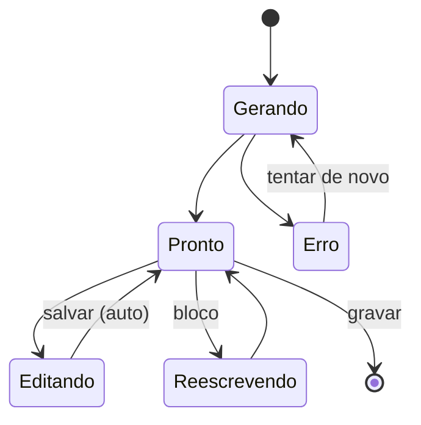

# UC-004 Revisar e editar script — estados

```mermaid
stateDiagram-v2
    [*] --> Gerando
    Gerando --> Pronto
    Gerando --> Erro
    Erro --> Gerando: tentar de novo
    Pronto --> Editando
    Editando --> Pronto: salvar (auto)
    Pronto --> Reescrevendo: bloco
    Reescrevendo --> Pronto
    Pronto --> [*]: gravar
```
