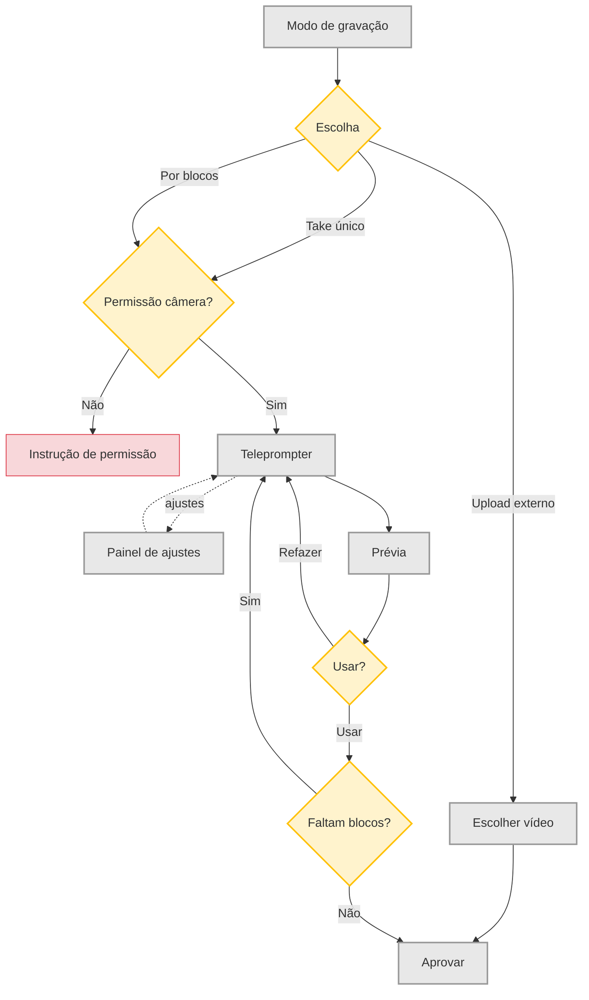

# UC-005 Gravar com teleprompter — fluxo

```mermaid
graph TD
    A[Modo de gravação] --> B{Escolha}
    B -->|Upload externo| U[Escolher vídeo] --> AP[Aprovar]
    B -->|Take único| P{Permissão câmera?}
    B -->|Por blocos| P
    P -->|Não| X[Instrução de permissão]
    P -->|Sim| T[Teleprompter]
    T -.ajustes.-> AJ[Painel de ajustes] -.-> T
    T --> V[Prévia]
    V --> Q{Usar?}
    Q -->|Refazer| T
    Q -->|Usar| R{Faltam blocos?}
    R -->|Sim| T
    R -->|Não| AP
    class A,T,AJ,V,AP,U screen
    class B,P,Q,R decision
    class X error
    classDef screen fill:#e8e8e8,stroke:#999,stroke-width:2px
    classDef decision fill:#fff3cd,stroke:#ffc107,stroke-width:2px
    classDef action fill:#d4edda,stroke:#28a745,stroke-width:1px
    classDef error fill:#f8d7da,stroke:#dc3545,stroke-width:1px
```
