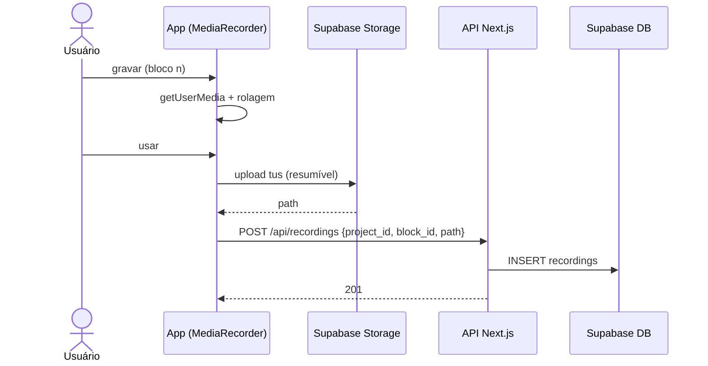

# UC-005 Gravar com teleprompter — sequência

```mermaid
sequenceDiagram
    actor U as Usuário
    participant F as App (MediaRecorder)
    participant ST as Supabase Storage
    participant API as API Next.js
    participant DB as Supabase DB
    U->>F: gravar (bloco n)
    F->>F: getUserMedia + rolagem
    U->>F: usar
    F->>ST: upload tus (resumível)
    ST-->>F: path
    F->>API: POST /api/recordings {project_id, block_id, path}
    API->>DB: INSERT recordings
    API-->>F: 201
```
