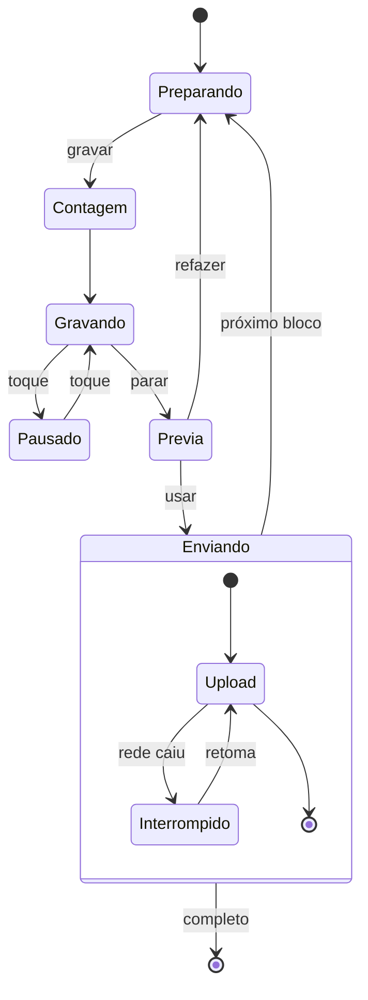

# UC-005 Gravar com teleprompter — estados

```mermaid
stateDiagram-v2
    [*] --> Preparando
    Preparando --> Contagem: gravar
    Contagem --> Gravando
    Gravando --> Pausado: toque
    Pausado --> Gravando: toque
    Gravando --> Previa: parar
    Previa --> Preparando: refazer
    Previa --> Enviando: usar
    state Enviando {
        [*] --> Upload
        Upload --> Interrompido: rede caiu
        Interrompido --> Upload: retoma
        Upload --> [*]
    }
    Enviando --> Preparando: próximo bloco
    Enviando --> [*]: completo
```
