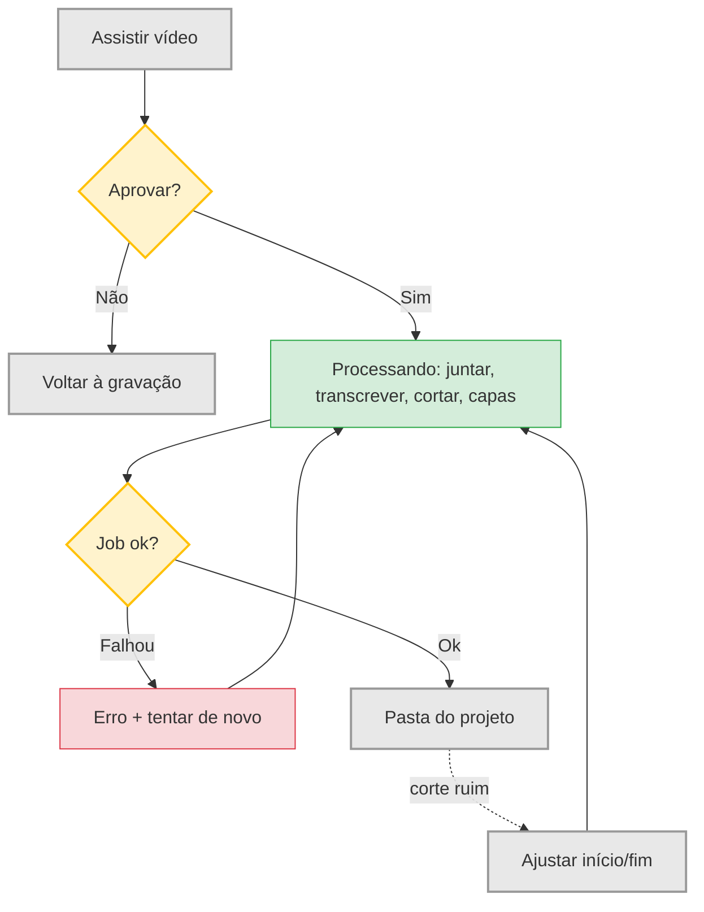

# UC-006 Aprovar e gerar entregáveis — fluxo

```mermaid
graph TD
    A[Assistir vídeo] --> B{Aprovar?}
    B -->|Não| G[Voltar à gravação]
    B -->|Sim| C[Processando: juntar, transcrever, cortar, capas]
    C --> D{Job ok?}
    D -->|Falhou| E[Erro + tentar de novo] --> C
    D -->|Ok| F[Pasta do projeto]
    F -.corte ruim.-> H[Ajustar início/fim] --> C
    class A,F,H,G screen
    class B,D decision
    class C action
    class E error
    classDef screen fill:#e8e8e8,stroke:#999,stroke-width:2px
    classDef decision fill:#fff3cd,stroke:#ffc107,stroke-width:2px
    classDef action fill:#d4edda,stroke:#28a745,stroke-width:1px
    classDef error fill:#f8d7da,stroke:#dc3545,stroke-width:1px
```
