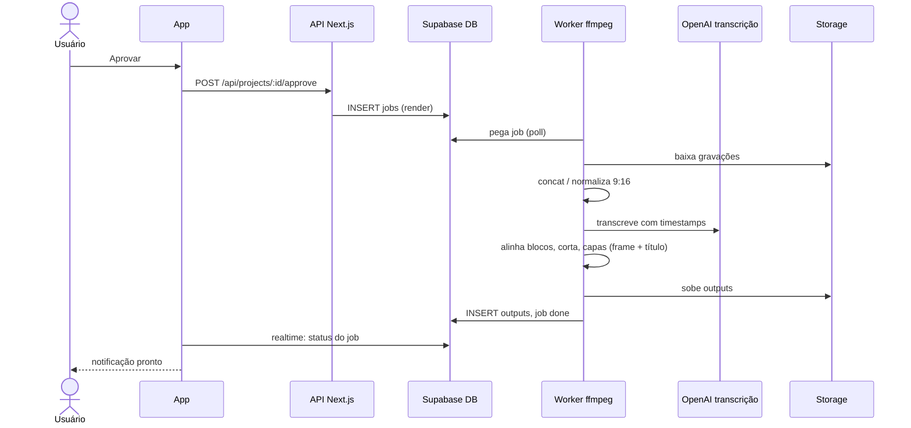

# UC-006 Aprovar e gerar entregáveis — sequência

```mermaid
sequenceDiagram
    actor U as Usuário
    participant F as App
    participant API as API Next.js
    participant DB as Supabase DB
    participant W as Worker ffmpeg
    participant T as OpenAI transcrição
    participant ST as Storage
    U->>F: Aprovar
    F->>API: POST /api/projects/:id/approve
    API->>DB: INSERT jobs (render)
    W->>DB: pega job (poll)
    W->>ST: baixa gravações
    W->>W: concat / normaliza 9:16
    W->>T: transcreve com timestamps
    W->>W: alinha blocos, corta, capas (frame + título)
    W->>ST: sobe outputs
    W->>DB: INSERT outputs, job done
    F->>DB: realtime: status do job
    F-->>U: notificação pronto
```
