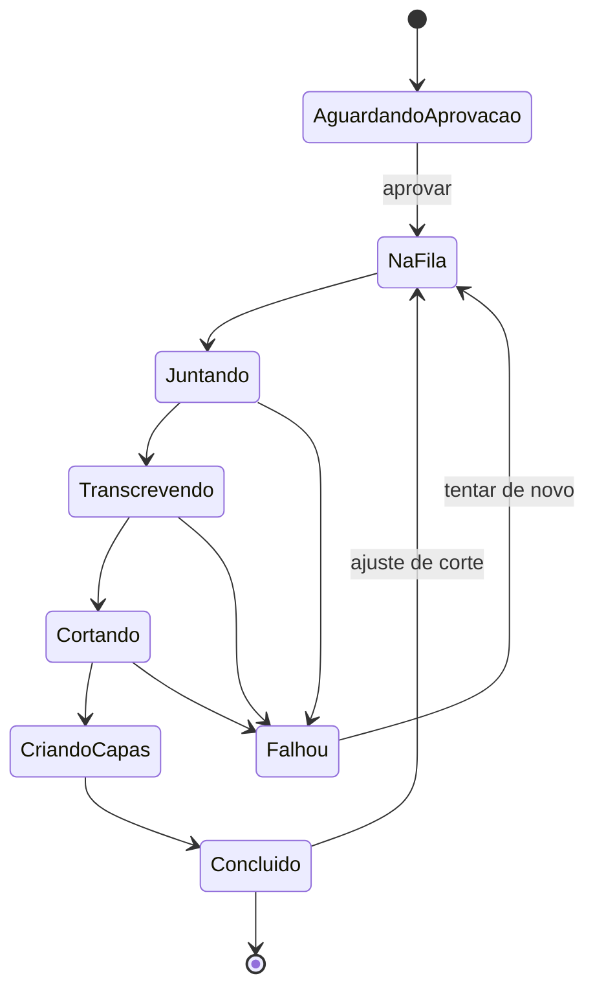

# UC-006 Aprovar e gerar entregáveis — estados

```mermaid
stateDiagram-v2
    [*] --> AguardandoAprovacao
    AguardandoAprovacao --> NaFila: aprovar
    NaFila --> Juntando
    Juntando --> Transcrevendo
    Transcrevendo --> Cortando
    Cortando --> CriandoCapas
    CriandoCapas --> Concluido
    Juntando --> Falhou
    Transcrevendo --> Falhou
    Cortando --> Falhou
    Falhou --> NaFila: tentar de novo
    Concluido --> NaFila: ajuste de corte
    Concluido --> [*]
```
