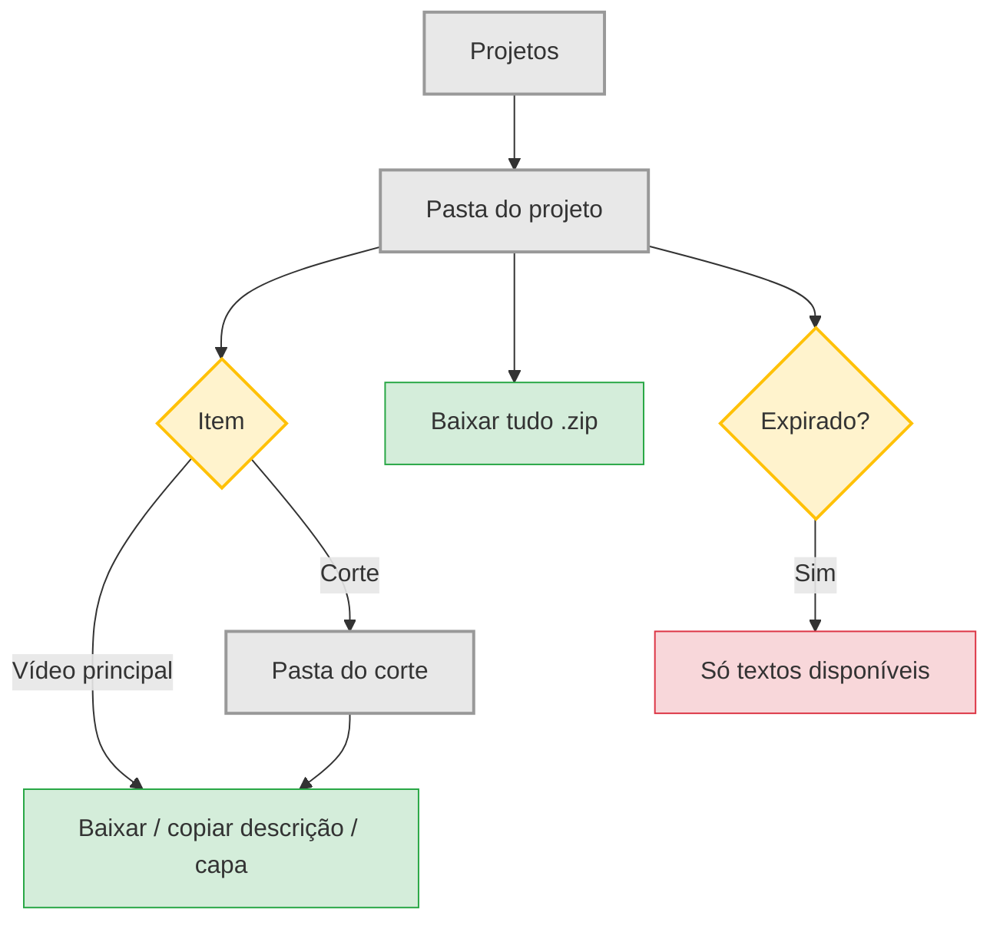

# UC-007 Baixar e organizar — fluxo

```mermaid
graph TD
    A[Projetos] --> B[Pasta do projeto]
    B --> C{Item}
    C -->|Vídeo principal| D[Baixar / copiar descrição / capa]
    C -->|Corte| E[Pasta do corte] --> D
    B --> Z[Baixar tudo .zip]
    B --> X{Expirado?}
    X -->|Sim| Y[Só textos disponíveis]
    class A,B,E screen
    class C,X decision
    class D,Z action
    class Y error
    classDef screen fill:#e8e8e8,stroke:#999,stroke-width:2px
    classDef decision fill:#fff3cd,stroke:#ffc107,stroke-width:2px
    classDef action fill:#d4edda,stroke:#28a745,stroke-width:1px
    classDef error fill:#f8d7da,stroke:#dc3545,stroke-width:1px
```
