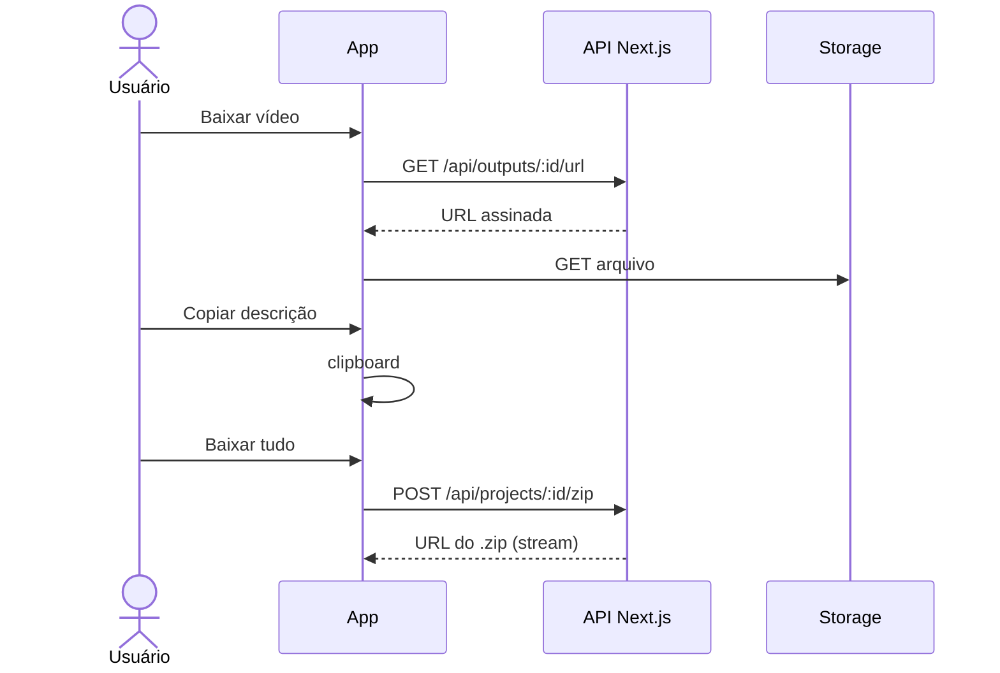

# UC-007 Baixar e organizar — sequência

```mermaid
sequenceDiagram
    actor U as Usuário
    participant F as App
    participant API as API Next.js
    participant ST as Storage
    U->>F: Baixar vídeo
    F->>API: GET /api/outputs/:id/url
    API-->>F: URL assinada
    F->>ST: GET arquivo
    U->>F: Copiar descrição
    F->>F: clipboard
    U->>F: Baixar tudo
    F->>API: POST /api/projects/:id/zip
    API-->>F: URL do .zip (stream)
```
